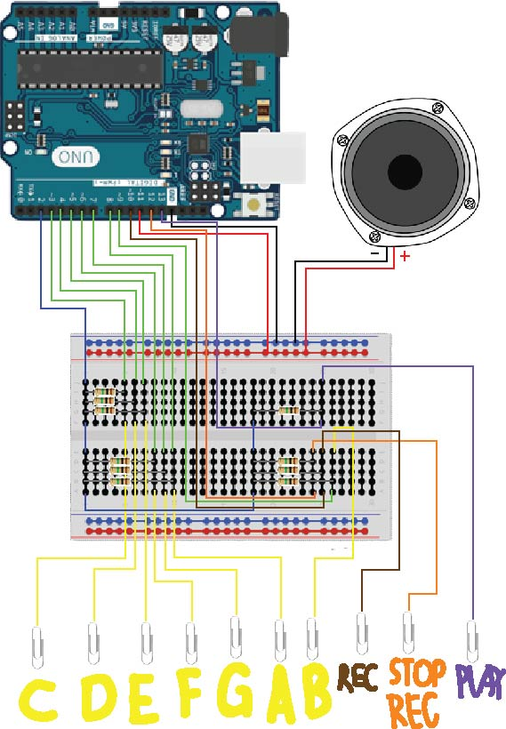

# Sound-like-a-melody-LaLaLa
สวัสดีครับวันนี้กลุ่ม Sound-like-a-melody-LaLaLa จะมาสอนวิธีทำpianoจากบอร์ดArduino Unoนะครับ pianoจากโค้ดของเรานั้นสามารถเล่นเสียงได้7ตัวนั้นคือ โด เร มี ฟา 
ซอล ลา ที (ไม่มีโดสูง) และสามารถทำการอัดเสียงที่เล่นได้ประมาณ 10 วิหลังจากเสียงสัญญาณ เมื่ออัดเสร็จสิ้นสามารถกดหยุดอัดหรือรอเวลาหมด จะมีเสียงสัญญาน(เหมือนตอนเริ่ม)ดังขึ้นมาเพื่อบอกว่าอัดเสร็จสิ้น สามารถกดอีกปุ่มเพื่อให้เล่นที่อัดไว้ได้ หากอัดเสียงไปแล้วจากนั้นทำการกดอัดใหม่ที่อัดไว้ก่อนหน้านี้จะถูกลบออกไป

Hello today Sound-like-a-melody-LaLaLa group will teach you how to create a piano from Arduino Uno board. Piano from our code can play 7 sounds that is Do Re Mi Fa Sol La Ti (No high Do) and able to record sound you play for about 10 seconds after the signal. When you're done with recording you can either press the stop record button or wait for time out there will be a signal (like the beginning) to alert you that it finished recording. You can press the play button to play the sound you record. If you already record something and then you press the record button again, the previous record will be delete.

#Material

ภาษาไทย

1.สายไฟตัวผู้ 2 หัว

2.บอร์ดArduino

3.ลำโพง

4.ตัวต้านทาน

5.คลิปหนีบกระดาษ

6.Breadboard

English

1. 2 male head wire

2. Arduino Board

3. Speaker

4. Resistor

5. Paper clips

6. Breadboard

#Instruction

ภาษาไทย

1.ทำการโหลดตัวlibrary Capacitive Sensorจากhttp://playground.arduino.cc//Main/CapacitiveSensor?from=Main.CapSense

2.ทำการลงตัวCapacitive SensorกับโปรแกรมArduinoให้เรียบร้อย

3.นำโค้ดจากทางเราไปใส่และทำการอัพโหลดเข้าไปในบอร์ดได้เลย

4.ทำการต่อสายไฟดังรูปภาพ

5.เสร็จสิ้นทำการเล่นPianoได้เลย

English

1.Download library Capacitive Sensor from http://playground.arduino.cc//Main/CapacitiveSensor?from=Main.CapSense

2.Install Capacitive Sensor to the Arduino program

3.Download our code and upload it into the board

4.Connect the wires as in the picture

5.Finish you can now play the piano

#Team member

นาย จิรายุ เพชรดำ 60070010

นางสาว ชุติกาญจน์ ธัญญกิจ 60070014

นาย นภนต์ ตั้งหลักมงคล 60070037

#Instructor

ผศ. ดร. กิติ์สุชาติ พสุภา

ผศ. ดร. ปานวิทย์ ธุวะนุติ

รายงานนี้เป็นส่วนหนึ่งของวิชา Computer Programming (รหัส 06016315)

คณะเทคโนโลยีสารสนเทศ สถาบันเทคโนโลยีพระจอมเกล้าเจ้าคุณทหารลาดกระบัง
